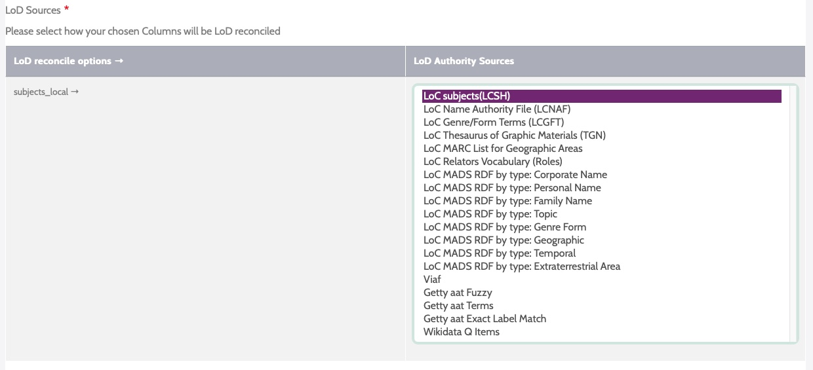
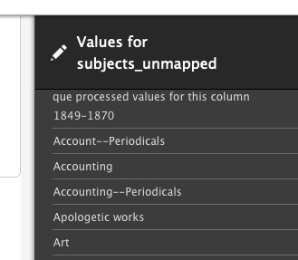
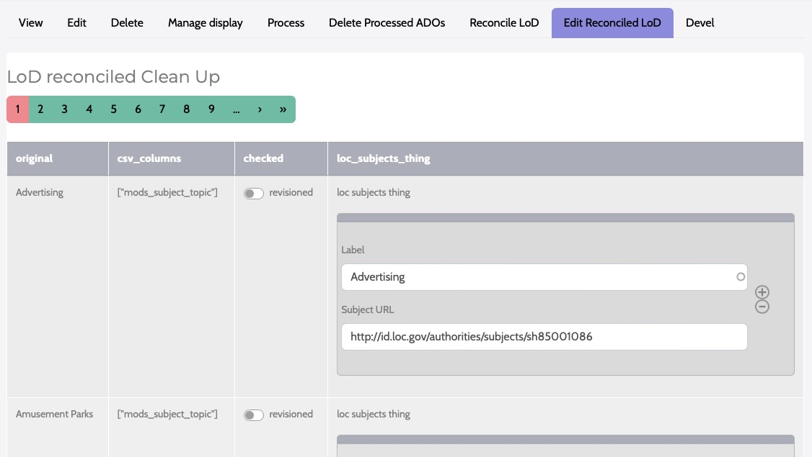

# Using AMI's Linked Data Reconciliation

Archipelago Multi Importer (AMI)'s Linked Data Reconciliation tool can be used to enrich your metadata with Linked Data (LoD). Using this tool, you can map values from your topical/subject metadata elements to your preferred LoD vocabulary source. These mappings can then be transformed via a corresponding Metadata Display (Twig) template to process the values into JSON-formatted metadata for your specified AMI set.

*The aim of this tool is to automize as much of the reconciliation process as feasible within Archipelago. Please be aware that data reconciliation will still be in part a manual and potentially time intensive process.*

### Important Note: Preliminary / Pre-requisite AMI Set Configuration

In order to Reconciliate an AMI Set, you will need to have selected the 'Template' or 'Custom' (then also, via 'Template' for your Digital Object or Collection types) during [Step 3 : Data Transformation](https://docs.archipelago.nyc/1.0.0-RC3/ami_spreadsheet_overview/#step-3-data-transformation-selections) of your AMI Set configuration.

Your source spreadsheet will also need to contain at least one column containing terms/names (values) you want to reconcile against an LoD Authority Source. Multiple values should be separated by '|@|'.

## Step 1: Select the AMI Set you will be working with.

From the main AMI Sets List page, click on your AMI Set's Name, or select the 'Edit' option from the Operations menu on the right-hand side of the Sets list.


## Step 2: Reconcile LoD Tab

Navigate to the Reconcile LoD tab.


## Step 3: LoD Reconciling Selections

From the list of columns from your spreadsheet source, select which columns you want to reconcile against LoD providers. 

Under the LoD Sources section, select how your chosen Columns will be LoD reconciled.
- LoD reconcile options will be on the left, LoD Authority Sources will be on the right.
- Example: 'local_subjects' will be mapped to 'LoC subjects (LCSH)'
	

	
??? info "Full list of potential LoD Authority Sources"

 - LoC subjects(LCSH)
 - LoC Name Authority File (LCNAF)
 - LoC Genre/Form Terms (LCGFT)
 - LoC Thesaurus of Graphic Materials (TGN)
 - LoC MARC List for Geographic Areas
 - LoC Relators Vocabulary (Roles)
 - LoC MADS RDF by type:
	- Corporate Name
	- Personal Name
	- Family Name
	- Topic
	- Genre Form
	- Geographic
	- Temporal
	- Extraterrestrial Area
 - VIAF
 - Getty aat Fuzzy / Terms / Exact Label Match
 - Wikidata Q Items

To preview the values contained in the column(s) you selected, click the 'Inspect cleaned/split up column values' button.
	


When you are ready, select the 'Process LoD from Source' button.

*Important note: if you have previously run LoD Reconciliation for your AMI set, this action will overwrite any manually corrected LoD on your Processed CSV. Please make sure you have a backup if unsure.*

Depending on the size of your AMI Set, the Reconciliation processing may take a few minutes. 
	


When the process is finished, you will see a brief confirmation message.
	


## Step 4: Edit Reconciled LoD

Open the 'Edit Reconciled LoD' tab.

You will see a table (form) containing:
- Your Original term values (labels)
- The CSV Column Header/Key from the source spreadsheet where the value is found
- A Checked option you can use to denote that an LoD mapping has been reviewed/revisioned
- The Linked Data Label and URL pairing selected during the LoD reconciliation process



The results table will show 10 original terms and mappings per page. You can advance through the pages using the page numbers and navigational arrows above and below the table.

## Step 5: Review and Edit your Reconciled LoD Mappings

Review the LoD reconciliation mappings, to make sure the best terms were selected for your metadata.

- To revise and select a different term mapping, begin by typing in the 'Label' box in the corresponding LoD lookup element. (You can type directly over an incorrect term or within an empty cell if no value was mapped/identified.)
- Select your preferred term and URL pairing from the list.
- You can also add or remove multiple mappings using the +/- buttons beside the LoD lookup element.
- If desired, click the Checked option to mark that the term was reviewed/revisioned.

As you advance through your review process, it is recommended that you use the 'Save Current LoD Page' at the bottom of each results page as you work. This will preserve the corrections you may have made and update the LoD Reconciled data for your AMI Set.


When you have finished, it is also recommended that you use the 'Save all LoD back to CSV File'.


_At this time, AMI's LoD Reconciliation processes from the results contained in the 'Edit Reconciled LoD' tab. In future AMI releases, the Processed Data CSV File will also be able to be manually updated and replaced, used for Reconciliation processing. For AMI 0.2.0, the Processed Data CSV is for reference purposes only._

## Step 6: AMI Set Review and Twig (Metadata Display) Preparation

You will now need to make sure that the Metadata Display (Twig) Template you selected to use during your initial AMI Set configuration is setup to Process your LoD mapped Label and URL selections into your Digital Objects and Collections JSON metadata.

For every JSON key/element in your metadata that you need to process the LoD Reconciled data into, you need to specify in your Template that data for this element will be read from the 'Processed Data' LoD information. 

In the following example Twig snippet, the "subject_loc" JSON key will map corresponding values from the 'Processed Data' (data.lod) LoD information into a newly created Digital Object/Collection during the AMI Set Processing.

```shell
"subject_loc": {{ data_lod.mods_subject_topic.loc_subjects_thing|json_encode|raw }},
```
 
- "subject_loc" = destination JSON Key or Property for your LoD values
- data.lod = directs the Twig template to source from the Processed Data LoD information (instead of the original AMI Source CSV accessed via 'data.xx_property_name')
- mods.subject.topic = the Column header in the original AMI Source CSV
- loc_subjects_thing = the Column containing the Label and URI/L pairs in the Processed Data LoD editable Table/Form (and reference CSV)

The same general pattern can be adapted to apply to different mapping scenarios (original CSV source columns to Reconciled LoD Sources) as needed.

??? info "Full list of Column Options => Corresponding LoD Sources"

- 'loc_subjects_thing' => LoC subjects(LCSH)
- 'loc_names_thing' => LoC Name Authority File (LCNAF)
- 'loc_genreForms_thing' => LoC Genre/Form Terms (LCGFT)
- 'loc_graphicMaterials_thing' => LoC Thesaurus of Graphic Materials (TGN)
- 'loc_geographicAreas_thing' => LoC MARC List for Geographic Areas
- 'loc_relators_thing' => LoC Relators Vocabulary (Roles)
- 'loc_rdftype_CorporateName' => LoC MADS RDF by type: Corporate Name
- 'loc_rdftype_PersonalName' => LoC MADS RDF by type: Personal Name
- 'loc_rdftype_FamilyName' => LoC MADS RDF by type: Family Name
- 'loc_rdftype_Topic' => LoC MADS RDF by type: Topic
- 'loc_rdftype_GenreForm' =>  LoC MADS RDF by type: Genre Form
- 'loc_rdftype_Geographic' => LoC MADS RDF by type: Geographic
- 'loc_rdftype_Temporal' =>  LoC MADS RDF by type: Temporal
- 'loc_rdftype_ExtraterrestrialArea' => LoC MADS RDF by type: Extraterrestrial Area :space_invader:
- 'viaf_subjects_thing' => VIAF
- 'getty_aat_fuzzy' => Getty aat Fuzzy
- 'getty_aat_terms' => Getty aat Terms
- 'getty_aat_exact' => Getty aat Exact Label Match
- 'wikidata_subjects_thing' => Wikidata Q Items

## Step 7: AMI Set Processing Preparation

When you have finished preparing your Template(s) as needed and completed your LoD Reconiliation Review, your AMI Set with LoD Reconciled Data will now need to be Processed.

To Process this set, navigate to the `Process` tab. You will have multiple options related to the Processing outcome for your AMI Set. 
- Select the "Desired ADOS Statuses After Process" for both Digital Objects (and Digital Object Collections, if also part of your ingest).
    - The Statuses you have available will reflect the publication workflow/moderation states (such as Draft, Published, Archived/Unpublished) setup in your Archipelago instance, and the permissions associated your user account.	
- Option 1: *'Enqueue but do not process Batch'*. Check this to enqueue but not trigger the interactive Batch processing. Cron or any other mechanism you have enabled will do the actual operation. This queue is shared by all AMI Sets in this repository and will be processed on a First-In First-Out basis.
- Option 2: *'Force every File attached to an ADO to be processed in its own Queue item'*.  Warning: This may make your ingest slower. Check this to force every file attached to an ADO to be downloaded and characterized as an independent process. This bypasses the Number of files Global setting that would otherwise trigger this behavior.
- Option 3: *'Re download and reprocess every file'*. Check this to force every file attached to an ADO to be downloaded and characterized again, even if on a previous Batch run that data was already generated for reuse. Needed if e.g the URL of a file is the same but the remote source changed.
- Select `Confirm` to continue. 
	


You may also select `Process` from the `Operations` menu for the AMI set from the main `AMI sets` page.


  
If you chose to 'Confirm" and Process your AMI Set immediately, proceed to Step 9: Processing and ADO Creation.   

## Step 8: Queue Manager (if not Processing immediately)

If you chose to place your AMI set in the Queue to Process in step 7, you may need to navigate to the Queue Manager found at `/admin/config/system/queue-ui`. (Be sure to select the `Queue Manager` under the System section, not the `Queue Manager for Hydroponic Service` under the Archipelago section). If the Queue operations for your Archipelago instance have been configured, you can simply leave your AMI Set in the Queue for Processing on the preconfigured schedule.


To Process your AMI Set immediately from the Queue Manager page, select the checkbox next to the 'AMI Digital Object Ingester Queue Worker'. Keep the `Action` menu set to `Batch Process` and click the `Apply to selected items` button.


## Step 9: Processing and ADO Creation

Your AMI set will now be Processed. You can follow the set's progress through the `Processing queues` loading screen.


After your AMI set is Processed, you will receive confirmation messages letting you know your Digital Objects were successfully created. 


  
From this message, you can click on each ADO title to review the new created Digital Object (or Collection) if you wish. Or, you may proceed to step 10.  

## Step 10: Review your newly created Digital Objects

Return to the main Content page found at `/admin/content` and review your newly created Digital Objects. After ensuring that files and metadata elements were mapped correctly, you may choose to change the Status for your Digital Objects to 'Published'. Celebrate your AMI success with a fresh coffee, tea, or cookie!

___

Thank you for reading! Please contact us on our [Archipelago Commons Google Group](https://groups.google.com/forum/#!forum/archipelago-commons) with any questions or feedback.

Return to the [Archipelago Documentation main page](index.md).

